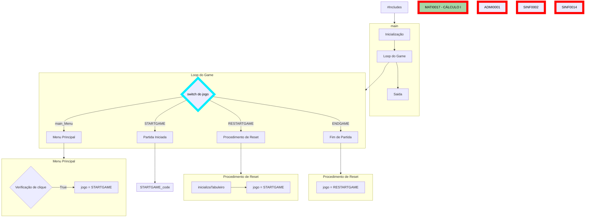

```mermaid
flowchart TD
    includes[#Includes] --> main
    subgraph main
        init[Inicialização] --> mainwhile[Loop do Game] --> return[Saida]
    end
        mainwhile --> mainwhile_code
        
        


    subgraph mainwhile_code[Loop do Game]

        main_switch{switch do jogo}
        main_switch -->|main_Menu| menu_principa[Menu Principal]
        main_switch -->|STARTGAME| STARTGAME[Partida Iniciada]
        main_switch -->|RESTARTGAME| RESTARTGAME[Procedimento de Reset]
        main_switch -->|ENDGAME| ENDGAME[Fim de Partida]
    end

    
    menu_principa --> menu_principa_code
    subgraph menu_principa_code[Menu Principal]
    if_startButton{Verificação de clique}
    if_startButton --> |True| play_Game[jogo = STARTGAME]
    end      

    STARTGAME --> STARTGAME_code
    subgraph STARTGAME_code
    end    
    
    RESTARTGAME --> RESTARTGAME_code
    subgraph RESTARTGAME_code[Procedimento de Reset]
    reset_tabuleiro_RESTARTGAME[inicializaTabuleiro] --> STARTGAME_RESTARTGAME[jogo = STARTGAME]
    end

    ENDGAME --> ENDGAME_code
    subgraph ENDGAME_code[Procedimento de Reset]
        STARTGAME_ENDGAME[jogo = RESTARTGAME]
    end


    

  %% Separação Por Niveis:
  

  main_switch:::N4
  MATI0017:::N1
  ADMI0001:::N1
  SINF0002:::N1
  SINF0014:::N1


  %% ==== N1 ====
  MATI0017[MATI0017 - CÁLCULO I]:::done


  classDef done fill:#A5D6A7,color:#000;       %% Verde pastel, texto preto
  classDef available fill:#90CAF9,color:#000;  %% Azul pastel, texto preto
  classDef active fill:#EF9A9A,color:#000;     %% Vermelho pastel, texto preto


  %% Classes de cores dos níveis
  classDef N1 stroke:#FF0000,stroke-width:10px,color:#000;
  classDef N2 stroke:#EAFF00,stroke-width:10px,color:#000;
  classDef N3 stroke:#00074A,stroke-width:10px,color:#000;
  classDef N4 stroke:#00EEFF,stroke-width:10px,color:#000;
  classDef N5 stroke:#0004FF,stroke-width:10px,color:#000;
  classDef N6 stroke:#F700FF,stroke-width:10px,color:#000;
  classDef N7 stroke:#7D0000,stroke-width:10px,color:#000;
  classDef N8 stroke:#00FF1A,stroke-width:10px,color:#000;
  classDef N9 stroke:#000000,stroke-width:10px,color:#000;
```
